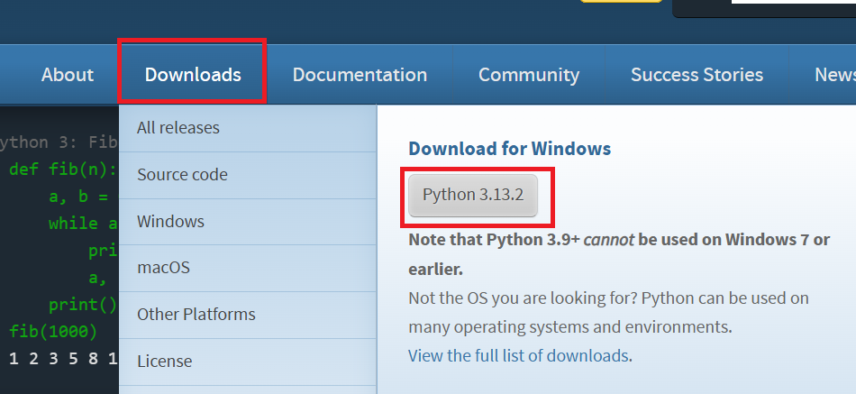
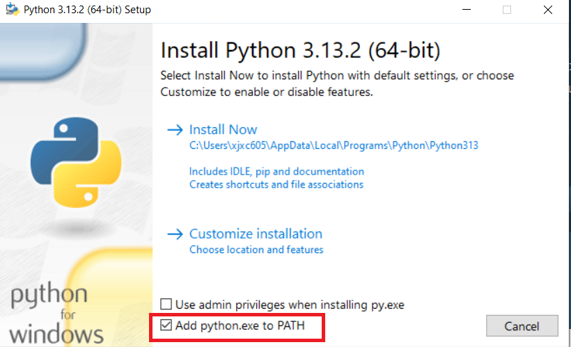
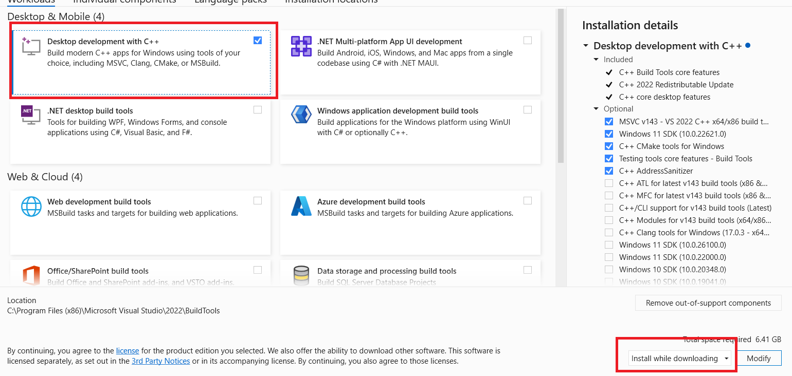
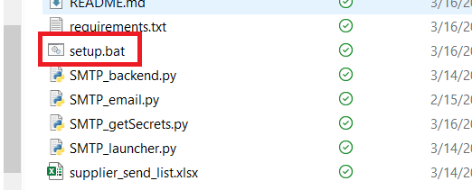

## FIRST TIME SET UP INSTRUCTIONS

STEP 1.	Go to [python offficial website](www.python.org)

STEP 2.	Hover mouse over Downloads and click on the button under Download for Windows

STEP 3.	Run the downloaded .exe file

STEP 4.	Select "Add python.exe to PATH"

STEP 5.	Click Install Now and Close when finished

STEP 7.	[Download Build Tools](https://visualstudio.microsoft.com/visual-cpp-build-tools/)

STEP 8.	Double click on setup.bat and wait for the black box to close

