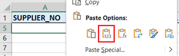
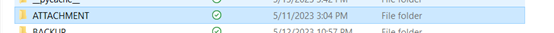

## HOW TO USE

[GO HERE FOR FIRST TIME SET UP](DOCUMENTATION/SETUP.md)

**STEP 1.** Open supplier_send_list.xlsx (DO NOT RENAME THIS FILE).

**STEP 2.** Add the supplier numbers you want to send (NO leading zeroes) in Column A. Duplicate supplier numbers will be ignored by the code. Column B to J are filled out by the code automatically. 

NOTE: If you copy and paste – you must right click, paste supplier numbers as values 

**STEP 3.** Save and close the supplier_send_list.xlsx file

**STEP 4.** Add file attachment you want to this folder (EACH FILE MUST BE UNDER 2MB). If your file name format looks like: 20002334_myfilename – the code will determine it’s unique for each supplier.

NOTE: If you want each supplier to get the SAME attachment DO NOT NAME YOUR FILE STARTING WITH NUMBERS.

**STEP 5.** Open the SMTP_launcher.py
NOTE: you must be on VPN, and have access to SQL SERVER and SNOWFLAKE
