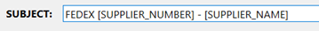
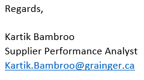

## HOW TO USE

[GO HERE FOR FIRST TIME SET UP](DOCUMENTATION/SETUP.md)

**STEP 1.** Open supplier_send_list.xlsx (DO NOT RENAME THIS FILE).

**STEP 2.** Add the supplier numbers you want to send (NO leading zeroes) in Column A. Duplicate supplier numbers will be ignored by the code. Column B to J are filled out by the code automatically. 

NOTE: If you copy and paste – you must right click, paste supplier numbers as values 


**STEP 3.** Save and close the supplier_send_list.xlsx file

**STEP 4.** Add file attachment you want to this folder (EACH FILE MUST BE UNDER 2MB). If your file name format looks like: 20002334_myfilename – the code will determine it’s unique for each supplier.


NOTE: If you want each supplier to get the SAME attachment DO NOT NAME YOUR FILE STARTING WITH NUMBERS.

**STEP 5.** Open the SMTP_launcher.py

NOTE: you must be on VPN, and have access to SQL SERVER and SNOWFLAKE

**STEP 6.**	Select the roles you want to send to, enter your message and subject


**STEP 7.**	Click SEND. 
NOTE: Any supplier number with SENT_STATUS equal to SENT in supplier_send_list.xlsx will be ignored by the code in LIVE MODE when retrying to send failed emails.

NOTE: This field is OPTIONAL. If you fill it out, all emails will be sent from the typed email address instead of the SPA aligned to supplier


**STEP 8.**	Check if any emails failed in status bar – open the supplier_send_list.xlsx file to see why it failed.


## MESSAGE VARIABLES

You can type in variables (CASE SENSITIVE) in your email message or subject to have the code fetch the corresponding information tied to that variable.

```
[SUPPLIER_NAME]     -> supplier name 

[SUPPLIER_NUMBER]   -> supplier number

[SPA_NAME]          -> spa name aligned to supplier

[SPA_TITLE]         -> spa title aligned to supplier

[SPA_EMAIL]         -> spa email aligned to supplier
```

### Example 1




### Example 2




## HTML FORMATING

You can place your text inside a HTML tag to have the desired format. 

[Click here for a more comprehensive list of tags](https://www.w3schools.com/tags/ref_byfunc.asp)

```
<b></b>             ->bold

<u></u> 		    -> underline

<i></i> 		    -> italics

<li></li> 		    -> bullet point

<h1>\/h1> 		    -> extra-large header

<h2></h2>		    -> large header

<h3></h3> 		    -> medium header

<h4></h4> 		    -> small header

<h5></h5>		    -> extra-small header

<a href=""></a>     -> hyperlink
```

### EXAMPLE 1. 
```
<b>THIS TEXT IS BOLD</b>
```


### EXAMPLE 2. 

```
<u><b>THIS TEXT IS BOLD AND UNDERLINED</b></u>
```


### EXAMPLE 3. 
```
<a href="https://www.google.com">What the reader sees</a>
```

